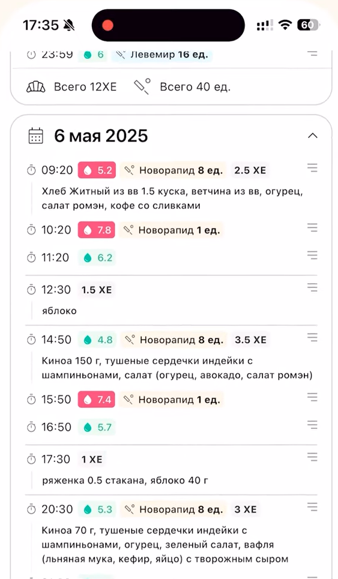

# 🌸 GSD Tracker

**GSD Tracker** — это интуитивно понятное веб-приложение, разработанное для беременных женщин с диагнозом **гестационный сахарный диабет (ГСД)**.  
Оно помогает **отслеживать уровень сахара в крови**, **учет инсулина** и **питание с автоматическим расчетом хлебных единиц (ХЕ)**.

> 💡 Приложение автоматически определяет, являются ли показатели сахара нормальными или повышенными, учитывая **время суток** и **время, прошедшее после еды** — это помогает принимать обоснованные решения.

---

## 🔗 Демо

👉 [Открыть приложение](https://shvedart.github.io/GSD/)

  
  

---

## 🚀 Возможности

- 📝 **Добавление записей**  
  Указывайте дату, время, уровень сахара, тип и количество инсулина, а также приемы пищи с автоматическим расчетом ХЕ.

- 🛡️ **Валидация данных**  
  Встроенные проверки обеспечивают корректность ввода и предотвращают ошибки.

- 📊 **Просмотр истории**  
  Все записи удобно сгруппированы по дням, с отображением суммарных показателей.

- 🛠️ **Редактирование и удаление**  
  Легко редактируйте или удаляйте любую запись при необходимости.

- 📁 **Импорт и экспорт**  
  Сохраняйте данные на диск и восстанавливайте при необходимости.

- 🌷 **Геймификация**  
  Получайте "цветы" за стабильные показатели — приятная мотивация для регулярного использования!

- 🧠 **Интеллектуальная оценка**  
  Уровень сахара оценивается в контексте времени дня и времени после еды — это делает мониторинг персонализированным и более точным.

---

## 📱 Использование на мобильных устройствах

Приложение оптимизировано для использования на смартфонах, является **статическим веб-приложением** и не требует сервера. Чтобы запустить приложение на вашем мобильном устройстве, просто откройте его в браузере.

 Для удобства вы можете добавить ярлык приложения на домашний экран вашего телефона:

*   **Для Android:** Откройте приложение в браузере (например, Chrome), нажмите на меню (три точки) и выберите "Добавить на главный экран".
*   **Для iOS:** Откройте приложение в браузере Safari, нажмите на кнопку "Поделиться" (квадрат со стрелкой вверх) и выберите "На экран «Домой»".

---

## 👩‍💻 Автор

Разработка: [Shvedart](https://github.com/Shvedart)  

---